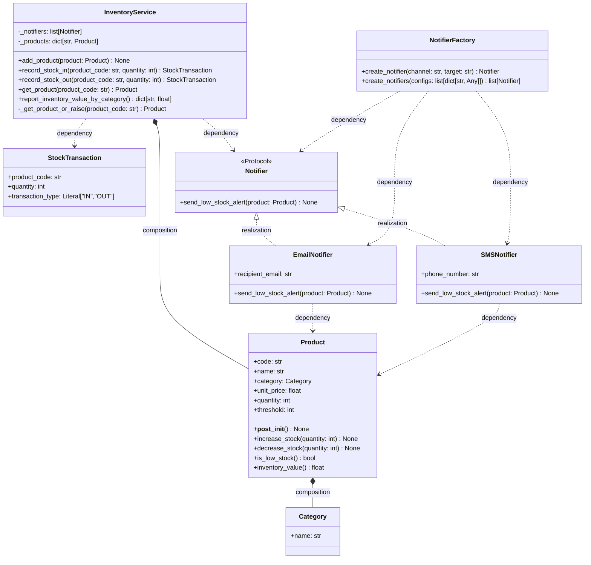

# Class Diagram

แผนภาพนี้สรุปโครงสร้างคลาสจาก `src/models.py`, `src/notifiers.py`, และ `src/service.py` โดยแสดงแอตทริบิวต์ เมธอด visibility และความสัมพันธ์หลัก ได้แก่ realization, composition และ dependency

คำอธิบายความสัมพันธ์:
- `Product` มี `Category` เป็นส่วนประกอบของข้อมูลสินค้า
- `InventoryService` ครอบครองรายการสินค้าและรายการ notifier ที่ใช้งานจริง
- `InventoryService` พึ่งพา `Notifier` เพื่อแจ้งเตือน และพึ่งพา `StockTransaction` เป็นผลลัพธ์ของการทำรายการรับ/จ่าย
- `EmailNotifier` และ `SMSNotifier` ทำตามสัญญา `Notifier` (realization)
- `NotifierFactory` พึ่งพาคลาส notifier ที่สร้างออกมา
