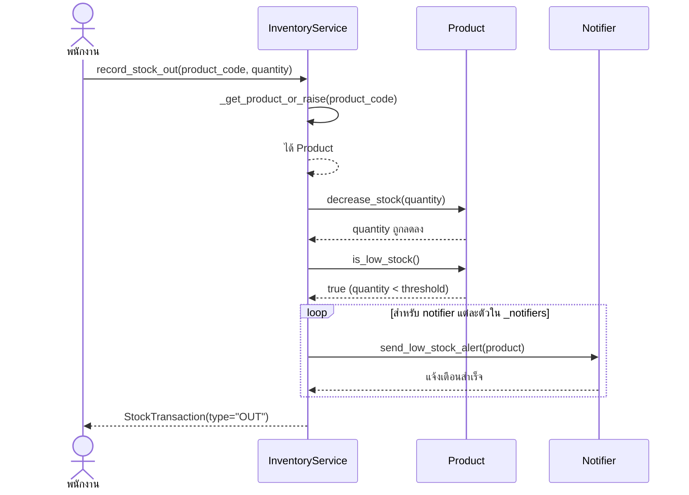

# Sequence Diagram

แผนภาพนี้แสดงลำดับการทำงานเมื่อพนักงานจ่ายสินค้าออกจากคลังจนจำนวนคงเหลือต่ำกว่า `threshold` ตั้งแต่การเรียก `InventoryService.record_stock_out()` (เทียบกับโจทย์ที่เรียก `issue()`) ไปจนถึงการเรียก `notifier.send_low_stock_alert()`

คำอธิบายลำดับงาน:
1. พนักงานสั่งจ่ายสินค้าโดยระบุรหัสสินค้าและจำนวน
2. `InventoryService` ตรวจสอบว่าสินค้ามีอยู่จริง
3. `InventoryService` เรียก `Product.decrease_stock()` เพื่อลดยอดคงเหลือ
4. จากนั้นตรวจด้วย `Product.is_low_stock()` ว่าต่ำกว่า `threshold` หรือไม่
5. เมื่อผลเป็นจริง ระบบวนเรียก `send_low_stock_alert(product)` ไปยัง notifier ทุกตัว
6. เสร็จแล้วคืนค่า `StockTransaction` ประเภท `OUT` กลับให้ผู้เรียก
